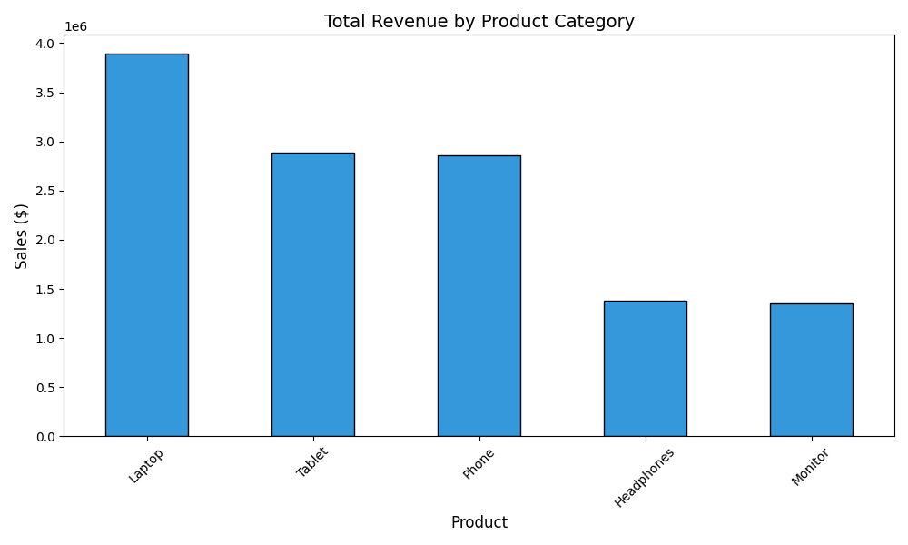
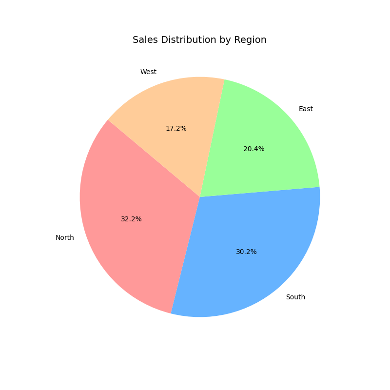

📑 Project Report: E-Commerce Sales Performance Analysis
1. Executive Summary
This report details the findings of a data analysis project focused on sales transactions from Q1 2024. The goal was to identify key revenue drivers, regional performance trends, and actionable business insights to improve future sales strategies.

2. Methodology
The analysis was conducted using a Python-based pipeline:

Data Source: sales_data.csv containing 100 transactions.

Tools: Pandas for data manipulation and Matplotlib for data visualization.

Process: Data was cleaned by converting date strings to datetime objects, checking for null values, and calculating total sales per category and region.

Getty Images
3. Key Findings
A. Revenue by Product Category
According to the visualization in visualizations/product_sales.png:
### Product Performance

Top Performer: Laptops are the highest revenue generator, contributing approximately $3.89M.

High-Growth Segments: Tablets and Phones follow as strong secondary drivers.

Underperformers: Monitors and Headphones represent the lowest sales volume, suggesting they are complementary goods rather than primary drivers.

B. Regional Market Distribution
According to the visualization in visualizations/regional_share.png:
### Regional Market Share

Market Leaders: The North and South regions account for over 62% of total revenue.

Opportunity Gap: The West region currently has the lowest market share at 17.2%.

4. Business Insights & Recommendations
Prioritize High-Ticket Inventory: Since Laptops drive the bulk of the revenue, focus supply chain efforts on maintaining stock for these items to avoid missed opportunities.

Regional Expansion: Investigate why the West region is underperforming. Consider localized marketing campaigns or discounts to increase brand awareness in that territory.

Cross-Selling Strategy: To boost "Low Performer" categories like Headphones and Monitors, implement a "Work-from-Home Bundle" discount when these items are purchased with a Laptop.

AOV Focus: With an Average Order Value (AOV) of $123,650, the business appears to be serving high-end or enterprise clients. Future strategies should focus on high-touch customer relationship management.